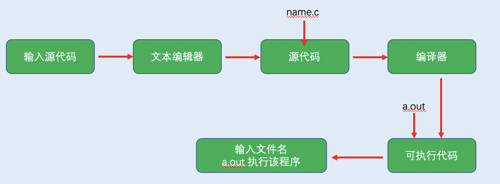

## 第一章 初识C语言

### 👉【[复习题](./复习题.md)】【[编程练习题](./编程题.md)】

### 1. C语言起源
- 时间：1972年
- 地点：贝尔实验室
- 创始人：丹尼斯.里奇（Dennis Ritch）和肯·汤姆逊（Ken Thompson）
起因：在开发UNIX操作系统时设计了C语言。在B语言基础上进行设计，起源于B语言。

### 2. 选择C语言的理由
- 设计特性
- 高效性
- 可移植性
- 强大而灵活
- 面向程序员

**缺点**：指针错误难以察觉。

### 3. C语言的应用范围
- UNIX操作系统
- 计算机游戏
- 嵌入式系统
- 机器人工厂
- PC应用
- 计算机语言
- 自动驾驶汽车、相机、DVD播放机和现代设备的微处理器

### 4. 高级计算机语言和编译器
编译器是将`高级语言程序`翻译成计算机所需的详细`机器语言指令集`的程序。主要负责处理冗长乏味的细节工作。

高级语言以更抽象的方式描述行为，没有与特定的CPU或指令集相关联，因此不同条件下需要使用不同的编译器，将高级语言程序编译成成适合在本地运行的机器语言指令集程序。

### 5. 语言标准
- 第一个ANSI/ISO C标准
  - 时间：1989年正式公布
  - 该标准（ANSI）定义了C语言和C标准库
  - 国际标准化组织于1990采用这套标准和ANSI C是完全相同的标准。

- C99 标准
  - 1994年修订了C标准，最终发布了C99标准。
- C11标准
  - 2007年承诺C标准的下一个版本是CIX。2011年发布了C11标准。

### 6. 使用C语言的7个步骤

- 定义程序的目标
- 设计程序
- 编写代码
- 编译（源代码）
- 运行程序
  - 常见的环境（Windows、UNIX终端模式和Linux终端模式）  
- 测试和调试程序
- 维护和修改程序

### 7. 编程机制
生成程序的具体过程因计算机环境而异。

#### 7.1 目标代码文件、可执行文件和库

C是可移植性语言，故可多环境使用，包括：`UNIX、Linux、MS-DOS、Windows和Macintosh OS`。

用C语言编写程序时，编写的内容被存储在叫作`源代码文本文件`中。文件名以 `.c` 结尾。

👉小Tips：在文件中，`点号（.）`前面的部分称为`基本名`，点号后面的部分称为`扩展名`。
> **文件名 = 基本名 + `.` + 扩展名**。例：hello.c

**基本策略**：使用程序将 `源代码文件` 转换为 `可执行文件`，此文件包含可以运行`机器语言代码`。

C实现的两个步骤：**编译和链接**。`编译器`将`源代码`转换为`中间代码 `，`链接器`将此`中间代码`与`其他代码`相结合生成`可执行文件`。

分块管理使得`程序模块化`，编译器会分块编译各个模块，`链接器`会将预编译过的模块再结合起来。

如果需要改变一个模块，则`不必重新编译所有其他的模块`。

将`源代码`转换为`机器语言代码`，将结果放置在一个 **`目标代码文件`**（或简称为目标文件）中 （源代码由单个文件组成）。

目标代码文件缺失`启动代码`（程序与OS之间的接口）和`库函数`。

**编译器作用**：把源代码转换成可执行代码的程序。

**链接器作用**：把编写的`目标代码、系统和标准启动代码和库代码`合并成一个`文件（可执行文件）`。

`目标文件（只包含编译器编写的代码翻译的机器语言代码）` 和 `可执行文件（包含程序中的库函数和启动代码的机器代码）` 是由`机器语言`指令组成。

#### 7.2 UNIX系统
在UNIX系统上编辑UNIX C不具备自己的编辑器。但可以使用一种通用UNIX编辑器 ，例如`emacs ,jove ,vi 或X-Windows`等文本编辑器。

UNIX区分大小写。

源文件是整个编译过程的开始，不是结束。

#### 7.3 在UNIX系统上编译

