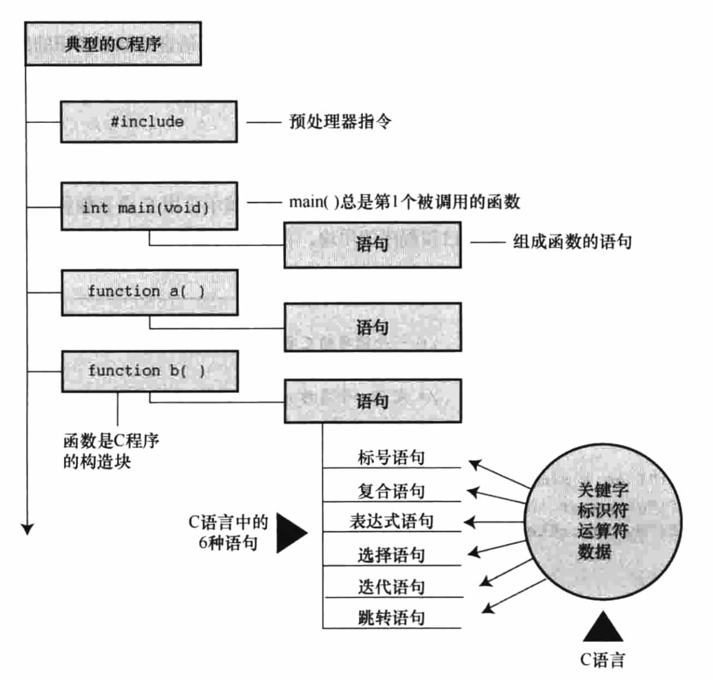
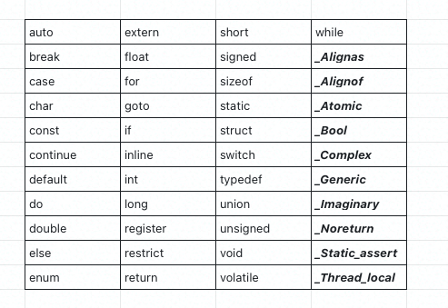

## 第二章 C语言概述

### 👉【[复习题](./复习题.md)】【[编程练习题](./编程题.md)】

### 1. 解析第一个C程序
一个基本的程序结构包含如下部分：



```c
#include<stdio.h> // 包含另一个文件，C编译器软件包的标准部分，提供键盘输入和屏幕输出的支持。
/**#include 指令和头文件
 * 是一条C预处理器指令（preprocessor directive），C编译器在编译前会对源代码做一些准备，即预处理（preprocessing）。
 *
 * stdio.h 文件的含义是标准输入/输出头文件。通常，在C程序顶部的信息集合被称为头文件（header）。
 */

int main(void) /*一个简单的C程序*/
/** main()函数
 * C程序一定要从main()函数开始执行，除了main()函数，可以任意命名其他函数。圆括号是用于识别main()是一个函数。
 */
{
/** 花括号、函数体和块
 * {
 *  ...
 * }
 * 
 * 所有的C函数都使用花括号标记函数体的开始和结束。
 * 不能省略
 */
    int num; 
    /**声明一个名为num的变量，int是C语言的一个关键字（keyword），表示一种基本的C语言数据类型，
     * num是一个标识符（identifier），也就是一个变量、函数或其他实体的名称。
     * 
     */
    num = 7; /*为num赋一个值*/

    printf("I'm a simple "); /*使用printf()函数*/
    printf("Computer .\n");
    printf("My favorite number is %d . \n",num); /*换行符是一个转义序列，转义序列用于代码难以表示或无法输入的字符，如 \t 代表 Tab键*/
    return 0; 
} //结束
```
> 程序由一个或多个函数组成，必须有`main()` 函数。
> 
> 函数由 `函数头` 和 `函数体` 组成。
> - 函数头包含`函数名、传入函数的信息类型和函数的返回类型`。
> - 函数体被`花括号`括起来，由一系列`语句、声明`组成。

### 2. 提高程序可读性的技巧
- 使用有意义的变量名和函数名
- 使用注释（模块太大时备注说明）
- 在函数中用空行分隔概念上的多个部分。
- 每条语句各占一行
    > 分行易读，配合分号，可以更好确定语句开始和结束。


### 3. 调试程序
Bug：程序的错误
调试（Debug）：找出并修正程序错误的过程。

#### 3.1 语法错误

不遵循C语言的规则，把有效的C符号放在正确的位置。

一般使用 `编译器（gcc）` 时会报错，一般情况下，报错的位置比实际错误位置要滞后一行。

#### 3.2 语义错误

编译器检测不到语义错误，因为这类错误未违反C语言的规则。

遵循C规则，但结果不正确的错误属于语义错误。

#### 3.3 程序状态
程序状态：在程序的执行过程中，某给定点上所有变量值的集合。

跟踪程序状态的3个方法
- 自己模拟计算机逐步执行程序。
    > 小部分程序实用，大型程序不适合。
- 在程序中的关键点插入额外的`printf() 语句`，以监视制定变量值的变化。
- 使用`调试器`
    > Linux环境中，C和C++一般使用`GDB调试器`。

### 4. 关键字和保留标识符

关键字由于特殊的含义，故不能用作标识符。



如果使用关键字不当（如，关键字用作变量名），编译器会将其视为语法错误。

保留标识符包括以下划线字符开头的标识符和标准库函数名，如printf() 。
