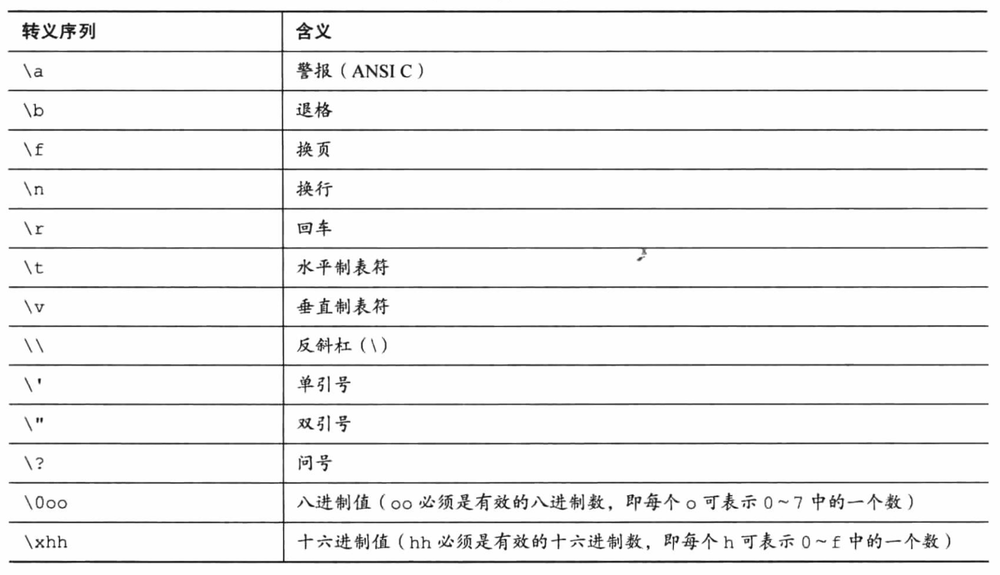

## 第三章 数据和C

### 👉【[复习题](./复习题.md)】【[编程练习题](./编程题.md)】

### 1. 变量与常量数据
数据：承载信息的数字和字符。

- **常量（constant）**：程序执行过程中不发生变化。
- **变量（variable）**：程序执行期间会发生变化或者被赋值。


### 2. 数据：数据类型关键字
- 常量数据，编译器一般通过用户书写的形式来识别类型。
- 变量数据，要在声明时指定其类型。


C语言的数据类型关键字：`int、long、short、char、float、double、void、signed、unsigned、_Bool`。
- int表示整数类型
- char用于指定字母或其它字符，也可表示较小整数。
- float和double表示小数点的数
- _Bool类型表示布尔值（true和false）

#### 2.1 位、字节和字
`位、字节和字`是描述计算机`数据单元`或`存储单元`的术语。
> `最小的存储单元` ----> `位(bit)`，可存储`0`或`1`，也是计算机内存的基本构建块。
> 
> 常用的`存储单位` ----> `字节（byte）`,`1 字节 = 8 bit（位）`
>
> 设计计算机时给定的`自然存储单位` ----> 字（word）`1字长 = 8位`。

#### 2.2 整数类型
整数就是`没有小数部分`的数。计算机一般使用`二进制（0和1组成）`存储整数。

#### 2.3 浮点数类型
浮点值：在一个值后面加上一个小数点。

计算机中的`浮点数`分成`小数部分`和`指数部分`来表示。

#### 2.4 整数和浮点数的区别
- 整数没小数部分，浮点数有小数部分。
- 浮点数可以表示的范围比整数大。
- 对于一些算术运算（减法），浮点数损失的精度更多。
- 计算机的浮点数不能表示区间所有的值，浮点数通常是实际值的近似值。

### 3. C语言基本数据类型
基本数据类型由11个关键字组成：`int、long、short、char、float、double、void、signed、unsigned、_Bool、_Complex和_Imaginary`。
#### 3.1 int类型
int类型是有符号整型，即int类型的值必须是整数（正整数、负整数或零）。其取值范围取决于计算机系统。
> 一般情况下，存储一个int占用一个机器字长。
- `int` ----> 系统给定的基本整数类型，C语言规定int类型不小于16位。
- `short 和 short int` ----> 最大的short类型整数小于或等于最大的int类型整数。C语言规定short类型至少占16位。
- `long或long int` ----> 可表示整数大于或等于最大的int类型整数。C语言规定long类型至少占32位。
- `long long 或 long long int` ----> 可表示的整数大于或等于最大的long类型整数。Long long类型至少占64位。

`无符号整型`只能表示`零和正整数`。在整数类型前加上 unsigned关键字表明变量为无符号整型。
> 无符号整型可表示的正整数比有符号整型的大。

声明int类型的变量，写int，再写变量名，以分号结束。
> 如果是多个变量，既可单独声明，也可int后列出多个变量名，变量名之间用逗号分隔。
```c
int years;
int month,week.days;
```
- 初始化变量
初始化变量：为变量赋一个初始值（在变量后面加上`赋值运算符（=）`和`待赋给变量的值`即可）。

⚠️注意：<u>最好不要把`初始化的变量`和`未初始化的变量`放在同一条声明中。</u>

👉 总结：声明为变量创建和标记存储空间，并为其指定初始值。

#### 3.2 使用字符：`char`类型
char 类型用于`存储字符`（如字母或标点符号）。
>技术角度，char是整数类型（实际上存储的是整数而不是字符）。

计算机用`ASCII编码`来处理字符，即特定的整数表示特定的字符。

`char`类型被定义为`8位（1字节）`的存储单元。

- 声明和初始化
```c
char grade = 'A';
char grade = A;
char grade = "A";
```
> 在C语言中，用`单引号`括起来的单个字符称为`字符常量`。
> 
> ⚠️注意：如果`省略单引号`，编译器则认为A是`变量名`。
>
> 如果使用`双引号` 括起来，则认为A是`字符串`。

- 非打印字符

单引号只适用于字符、数字和标点符号。但表示特殊行为的符号序列，则只能通过转义序列来打印。常见的转义序列及其含义如下：



⚠️注意：<u>在使用ASCII码时，注意数字和数字字符的区别。</u>

#### 3.3 布尔类型
`布尔值`表示`true`和`false`。C语言用1表示true，0表示false。

`_Bool` ----> 布尔类型的关键字。布尔类型是无符号int类型，所占用的空间只能存储0或1即可。

#### 3.4 实浮点类型
实浮点类型可表示 `单精度浮点型` 和 `双精度浮点型`。

- `float` ----> 单精度浮点型，系统的基本浮点类型，可精确到至少6位有效数字。
- `double` ----> 双精度浮点型，存储范围更大，能表示至少10位有效数字和更大的指数。

#### 3.5 复数和虚数浮点数
虚数类型是可选的类型。

复数的`实部`和`虚部`类型都基于实浮点类型来构成。
```c
float _Complex
double _Complex
long double _Complex
float _Imaginary
double _Imaginary
long long _Imaginary
```
#### 3.6 如何声明简单变量
> 1. 选择需要合适的类型
> 2. 使用有效的字符给变量起一个变量名
> 3. 声明格式：`类型说明符 变量名;`
> 4. 声明的同时可进行初始化变量
> 5. 可同时声明多个相同类型的多个变量，用逗号分隔各个变量名。
> 6. ⚠️注意合理选择合适的类型（编译器类型检查时，会导致部分不匹配的数据丢失）。

#### 3.7 求类型大小的例子
```
#include<stdio.h>

int main(void)
{
    /* C99 为类型大小提供了%zd转换说明 */

    /**sizeof()是C语言的内置运算符，以 字节 为单位给出指定类型的大小。
     * 
     * 在C99 和 C11 提供 %zd 转换说明匹配sizeof 的返回类型。
     * 
     * 如果一些编译器不支持，就使用 %u 或 %lu 代替 %zd。
     *
     */
    printf("打印 int 类型的字节大小为：%zd \n",sizeof(int));
    printf("打印 char 类型的字节大小为：%zd \n",sizeof(char));
    printf("打印 long 类型 的字节大小为：%zd \n",sizeof(long));
    printf("打印 long long 类型 的字节大小为：%zd \n",sizeof(long long));
    printf("打印 double 类型的字节大小为：%zd \n",sizeof(double));
    printf("打印 long double 类型的字节大小为：%zd \n",sizeof(long double));

    return 0;
}
```

👉 小Tips：使用`printf()` 函数时，切记检查每个待打印值对应的转换说明，还要检查转换说明的类型是否与待打印值的类型相匹配。
> 转换说明简单的形式：`百分号（%）` 和 `转换字符` 组成，如`%d`。
