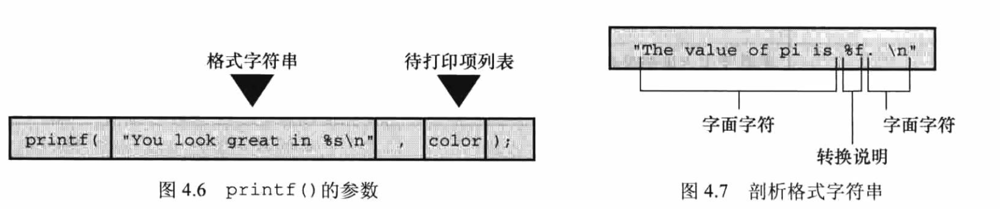
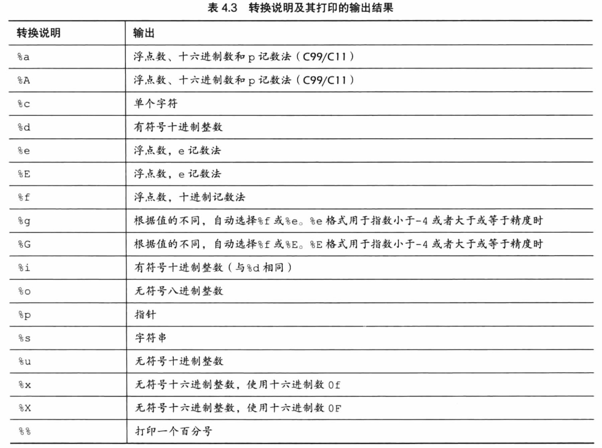

## 第四章 字符串和格式化输入/输出

### 👉【[复习题](./复习题.md)】【[编程练习题](./编程题.md)】

## 1. 字符串简介

### 1.1 char类型数组和null字符
字符串 是一个或多个字符的序列。
> 由双引号括起来。

C语言没有专门用于储存字符串的变量类型，字符串都是被存储到`char类型`的数组中。

数组是由`连续`的存储单元组成，字符串的字符被存储在`相邻的存储单元`中，每个单元存储一个字符。

⚠️注意：在数组末尾位置的字符是 `\0`。这是一个`空字符（null character）`。

C语言中使用 `\0` 规定了标记字符串的`结束`。<u>空字符串不是数字0。是非打印字符，对应的ASCII码值是：0。</u>

### 1.2 `strlen()`函数
string.h头文件 包含了`strlen()`函数和其他与字符串相关的函数（如拷贝字符串的函数和字符串查找函数）。

`sizeof运算符`以`字节`为单位给出对象的`大小`。（把字符串末尾不可见的空字符计算在内）
> 运算对象是类型时，圆括号不可少，是特定变量时，可有可无。


`strlen()`函数给出字符串中的`字符长度`。

## 2. 常量和C预处理器
```c
#define PI 3.14;
```
这样输入实际值的常量叫作 `符号常量` 或 `明示常量`。

### 2.1 创建符号常量的方法
- 声明一个变量，然后将变量设置为所需的常量。
- 使用 `#define`（C预处理器）来定义常量（编译程序时替换）。
> ~~中间没有 = 符号，末尾不加分号~~。
> 
> 一般推荐 `#define` 声明的常量变量名`大写`。大写常量可提高程序的可读性。

### 2.2 const限定符
C90标准增加`const关键字`。用于限定一个变量为`只读`。
```c
const int age = 25; // 变量在程序中不可更改
```
const 比 #define更灵活。

### 2.3 明示常量
C头文件中提供了两种明示常量。
- `limits.h` 提供了与整数类型大小限制相关的一系列明示常量。
- `float.h` 提供了与浮点数大小限制相关的明示常量。

## 3. `printf()` 和 `scanf()`

`printf()` 和 `scanf()` 函数让用户与程序交流，属于`输入输出函数（I/O函数）`。

### 3.1 printf() 函数
请求printf() 函数打印数据的指令要与待打印数据的类型相匹配。

printf()中包含的信息：



`转换说明`：指定如何把数据转换成可显示的形式。ANSI C常见的转换说明符如下：



⚠️注意：***格式字符串中的转换说明一定要与后面的每个项相匹配***。

👉**小Tips**：可以使用`转换说明符`控制输出的外观：`字段宽度、小数位和字段内的布局`。

### 3.2 scanf() 函数
scanf() 函数的规则：
- 如果`scanf()` 读取`基本变量类型的值`，在`变量名前面加上一个 &`。
- 如果用 `scanf()` 把字符串读入到`字符数组`中，`不要使用 &`。

