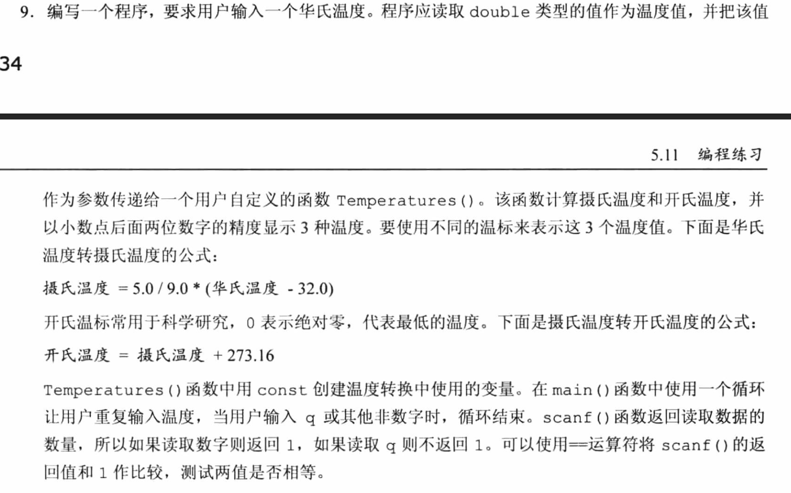

## 第五章 运算符、表达式与语句 编程练习题

1. 编写一个程序，把用分钟表示的时间转换成用小时和分钟表示的时间。使用#define或const创建一个表示60的符号常量或const变量。通过while循环让用户重复输入值，直到用户输入小于或等于0的值才停止循环。
```c
#include<stdio.h>
#define HOUR_PER_MIN 60 // 一小时60分钟

int main(void)
{
    int min,hour,left;

    printf("把分钟转换成 小时 - 分钟数形式\n");
    printf("请输入你的分钟数(如果小于或等于0的值停止循环)：");
    scanf("%d",&min);

    while(min>0)
    {
        hour = min / HOUR_PER_MIN; // 截断小时数
        left = min % HOUR_PER_MIN; // 剩下的分钟数

        printf("%d 分钟 = %d 小时 - %d 分钟\n",min,hour,left);

        printf("请输入下一个分钟数(如果小于或等于0的值停止循环)：");
        scanf("%d",&min);
    }
    printf("结束了！\n");

    return 0;
}
```


2. 编写一个程序，提示用户输入一个整数，然后打印从该数到比该数大10的所有整数（例如，用户输入5，则打印5～15的所有整数，包括5和15）。要求打印的各值之间用一个空格、制表符或换行符分开。
```c
#include<stdio.h>

int main(void)
{
    int num01;

    printf("请输入一个整数：");
    scanf("%d",&num01);

    int num02 = num01 + 10;
    while(num01<=num02)
    {
        printf("  %d",num01);
        num01++; // 递增运算符的应用
    }
    printf("\n");
    return 0;
}
```
3.  编写一个程序，提示用户输入天数，然后将其转换成周数和天数。例如，用户输入18，则转换成2周4天。以下面格式显示结果：<br>
18 days are 2 weeks, 4 days.<br>
通过while循环让用户重复输入天数，当用户输入一个非正值时（如0或-20），循环结束。
```c
#include<stdio.h>
#define WEEK_PER_DAY 7

int main(void)
{
    int days,weeks,left;

    printf("请输入天数(天数为非正值时停止)：");
    scanf("%d",&days);

    while(days>0)
    {
        weeks = days / WEEK_PER_DAY; // 截断
        left = days % WEEK_PER_DAY; // 剩余的天数
        printf("%d days are %d weeks %d days\n",days,weeks,left);

        printf("请输入下一个天数(天数为非正值时停止)：");
        scanf("%d",&days);
    }
    printf("结束了！\n");

    return 0;

}
```

4. 编写一个程序，提示用户输入一个身高（单位：厘米），并分别以厘米和英寸为单位显示该值，允许有小数部分。程序应该能让用户重复输入身高，直到用户输入一个非正值。其输出示例如下：
```markdown
Enter　a　height　in　centimeters:　182
182.0　cm　=　5　feet,　11.7　inches
Enter　a　height　in　centimeters　(<=0　to　quit):　168.7
168.0　cm　=　5　feet,　6.4　inches
Enter　a　height　in　centimeters　(<=0　to　quit):　0
bye
```

```c
#include<stdio.h>
#define INCH_P_CM 0.3937008	//一厘米是0.3937008英寸
#define FEET_P_CM 0.0328084	//一厘米是0.032808英尺
#define INCH_P_FEET 12	//一英尺(feet)是12英寸(inch)

int main(void)
{
    float height;
    int feet;
    float inch;

    printf("请输入身高（单位：厘米）(输入一个非正值就停止)：");
    scanf("%f", &height);

    while (height>0)
    {
        feet = height * INCH_P_FEET;
        inch = height * INCH_P_CM - feet * INCH_P_FEET;
        printf("%.1f CM = %d feet  %.1f inches  \n",height,feet,inch);

        printf("请输入下一个身高（单位：厘米）(输入一个非正值就停止)：");
        scanf("%f", &height);
    }

    printf("结束了！bye-bye！");

    return 0;
}
```

5. 修改程序addemup.c（程序清单5.13），你可以认为addemup.c是计算20天里赚多少钱的程序（假设第1天赚$1、第2天赚$2、第3天赚$3，以此类推）。修改程序，使其可以与用户交互，根据用户输入的数进行计算（即，用读入的一个变量来代替20）。
```c
#include<stdio.h>

int main(void)
{
    int count=0;
    int sum = 0;
    int end_days;

    printf("请输入天数：");
    scanf("%d",&end_days);

    while(count++<end_days)
        sum += count; // 计算总钱数
    printf("第 %d 天赚了 %d 美元\n",end_days,sum);

    return 0;
}
```


6. 修改编程练习5的程序，使其能计算整数的平方和（可以认为第1天赚$1、第2天赚$4、第3天赚$9，以此类推，这看起来很不错）。C没有平方函数，但是可以用n * n来表示n的平方。
```c
#include<stdio.h>

int main(void)
{
    int count=0;
    int sum = 0;
    int end_days;

    printf("请输入天数：");
    scanf("%d",&end_days);

    while(count++<end_days)
        sum += count*count; // 计算总钱数
    printf("第 %d 天赚了 %d 美元\n",end_days,sum);

    return 0;
}
```

7. 编写一个程序，提示用户输入一个double类型的数，并打印该数的立方值。自己设计一个函数计算并打印立方值。main()函数要把用户输入的值传递给该函数。
```c
#include<stdio.h>
double Cal_cube(double n); // 声明函数原型

int main(void)
{
    double n,cube;
    
    printf("请输入一个数字：");
    scanf("%lf", &n);

    cube = Cal_cube(n);
    printf("%.2f 对应的立方值是：%.2f \n", n,cube);

    return 0;
}

double Cal_cube(double n) // 计算立方值的函数
{
    return n*n*n;
}
```

8. 编写一个程序，显示求模运算的结果。把用户输入的第1个整数作为求模运算符的第2个运算对象，该数在运算过程中保持不变。用户后面输入的数是第1个运算对象。当用户输入一个非正值时，程序结束。其输出示例如下：
```markdown
This　program　computes　moduli.
Enter　an　integer　to　serve　as　the　second　operand:　256
Now　enter　the　first　operand:　438
438　%　256　is　182
Enter　next　number　for　first　operand　(<=　0　to　quit):　1234567
1234567　%　256　is　135
Enter　next　number　for　first　operand　(<=　0　to　quit):　0
Done
```
```c
#include<stdio.h>

int main(void)
{
    int first_object;
	int sec_object;
	int result ;
	
	printf("This program computes moduli. \n");

	printf("Enter an integer to serve as the second operand :  ");
	scanf("%d", &sec_object);

	printf("Now enter the first operand :  ");
	scanf("%d", &first_object);
	while (first_object > 0)
	{
		result =first_object % sec_object;
		printf("%d %% %d is %d \n", first_object, sec_object, result);
		printf("Enter next number for first operand (<= 0 to quit) :  ");
		scanf("%d", &first_object);
	}

    printf("结束了!\n");
	return 0;
}
```
9. 题目太长，直接用图片了



```c
#include<stdio.h>

void Temperatures(double fahrenheit);

double fahrenheit; // 华氏温度
double celsius; // 摄氏温度
double kelvin; // 开氏温度（卡尔文温标）

int main(void)
{
    

    printf("请输入一个华氏温度（输入q就停止）：");
    

    while(scanf("%lf",&fahrenheit))
    {
        Temperatures(fahrenheit);
        printf("Fahrenheit : %.2f     Celsius : %.2f    Kelvin : %.2f \n",fahrenheit,celsius,kelvin);
        printf("请输入一个华氏温度（输入q就停止）：");
        scanf("%lf",&fahrenheit);
    }
    printf("结束了！Bye-bye！\n");

    return 0;
}

void Temperatures(double fahrenheit)
{
    // 用来存储常量
    const double left = 32.0; 
    const double add = 237.16;

    celsius = 5.0 / 9.0 * (fahrenheit - left);
    kelvin = fahrenheit + add;
}
```