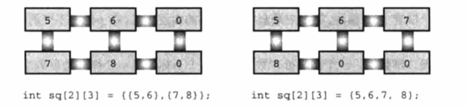

## 第十章 数组和指针

### 👉【[复习题](./复习题.md)】【[编程练习题](./编程题.md)】
## 1. 数组的概述
### 1.1 声明数组
数组由 `数据类型` 相同的一系列元素组成。

需要使用数组时，通过声明数组告诉编译器数组中内含多少元素和这些元素的类型。

普通变量可以使用的类型，数组元素都可以使用。

### 1.2 声明数组
数组声明示例：

```c
int main(void)
{
    float candy[365]; /*内含365个float类型元素的数组*/
    char code[12]; /*内含12个char类型元素的数组*/
    int states[50]; /*内含50个int类型元素的数组*/
}
```

只要有 `方括号（[]）` 就都是数组，方括号中的数字表明数组中的`元素个数`。

如果要 `访问` 数组中的元素，通过使用数组 `下标数字（也称为索引）`表示数组中的各元素。

数组的元素的编号从 ` 0 ` 开始。
### 1.3 初始化数组
数组通常被用来储存程序需要的数据。

只储存单个值的变量又叫做 ` 标量变量（scalar variable）`。

用以 ` 逗号 ` 分隔的 ` 元素值列表（用花括号括起来）`来初始化数组，各元素值之间用 ` 逗号 ` 分隔。 在逗号和元素值之间可以使用空格。

```c
int num[4] = {1,2,3,4};
```
### 1.4 给数组元素赋值
声明数组之后，就可以借助数组 `下标（或索引）`给数组元素赋值。

**注意点**：在C语言中，不允许把数组作为一个单位赋值给另一个数组，除了初始化以外也不允许使用花括号列表的形式赋值。

案例代码：

```c
#define SIZE 5
int main(void)
{
    int oxen[SIZE] = {5,3,2,8}; // 初始化没问题
    int yaks[SIZE];

    yaks = oxen; // 不允许这么赋值
    yaks[SIZE] = oxen[SIZE]; // 数组的下标越界
    yaks[SIZE] = {5,3,2,8}; // 不起作用
}
```
### 1.5 使用指定初始化器（C99）

C99的新特性：`指定初始化器（disignated initializer）`。

```
int arr[6] = {0,0,0,0,0,0,2}; // 传统的语法
```
> C99规定，可以初始化列表中使用带方括号的下标指明待初始化的元素。

```
int arr[6] = {[5] = 2}; // 把arr[5] 初始化为2
```
> 对于一般的初始化，在初始化一个元素后，末初始化的元素的都会被设置为 0 。

⚠️注意：***`在使用数组时，要防止数组下标超出边界。必须确保下标是有效的值`***。

## 2. 多维数组


### 2.1 初始化二维数组
初始化二维数组是建立在`初始化一维数组`的基础上。

初始化一维数组的格式如下：

```c
数据类型 arr[5] = {val01,val02,val03,val04,val05}; // val01、val02等表示数据类型的值。
```

> 初始化时也可省略内部的花括号，只保留最外面的一对花括号。只要保证初始化的`数值个数`正确，初始化结果就不会出错。

> 如果初始化的数值不够，按照先后顺序逐行初始化，直到用完所有的值。后面没有值初始化的元素被统一初始化为0。

初始化二维数组的两种方法：



### 2.2 其他多维数组

声明一个三维数组：

```c
int  box[10][20][30]; // 10个二维数组（每个二维数组都是20行30列）
```

对于多维数组的处理，使用`多重循环`控制来处理。

## 3.数组和指针

指针以`符号`形式使用地址。

`数组表示法`也是`变相使用指针`。

- 指针的值是所指向对象的地址。地址的表示方式依赖于计算机内部的硬件。

- 在指针前面使用运算符可以得到该指针所指向对象的值。

- 指针加1，指针的值递增它所指向`类型的大小`（以字节为单位）。

## 4. 函数、数组和指针

使用数组表示法处理数组的函数，也就是使用指针作为参数。

数组名是数组首元素的地址。
> 既可以用`指针`表示`数组名`，也可以使用`数组名`表示`指针`。


## 5. 指针操作
```c
#include<stdio.h>
int main(void)
{
    int urn[5] = {10,20,30,40,50};
    int *ptr1, *ptr2, *ptr3;

    ptr1 = urn; // 指向数组的首个元素，也就是urn数组的首地址
    ptr2 = &urn[2];// 一个地址赋给指针，也就是urn数组的第三个元素(urn[2])的地址

    printf("指针的值 ；间接引用指针 ； 指针的地址：\n");
    // 解引用：*运算符给出指针指向地址上储存的值。注意：不要解引用未初始化的指针。
    // 取址：指针也有主机的地址和值。&运算符给出指针本身的地址。
    printf("ptr1 = %p ; *ptr1 = %d ; &ptr1 = %p \n", ptr1,*ptr1,&ptr1); 

    // 指针的加法：整数都会与指针所指向类型的大小（以字节为单位）相乘，然后结果与初始地址相加。
    ptr3 = ptr1 + 4;
    printf("\n 指针加上一个整数 ：\n");
    printf("ptr1 + 4 = %p ; *(ptr1 + 4) = %d \n",ptr1+4,*(ptr1+4));

    ptr1++; // 递增指针：指向数组元素的指针可以让指针移动到数组的下一个元素。
    printf("\n ptr1++的值是：\n");
    printf("ptr1 = %p ; *ptr1 = %d ; &pt1 = %p \n",ptr1,*ptr1,&ptr1);

    ptr2--; // 递减指针
    printf("--ptr2的值是：\n");
    printf("ptr2 = %p ; *ptr2 = %d ; &pt2 = %p\n",ptr2,*ptr2,&ptr2);

    --ptr1; // 恢复为初始值
    ++ptr2; // 恢复为初始值

    printf("\n 恢复为初始值的指针为：\n");
    printf("ptr1 = %p ; ptr2 = %p\n",ptr1,ptr2);

    // 一个指针减去另一个指针
    printf("\n 一个指针减去另一个指针：\n");
    printf("ptr2 = %p ; ptr1 = %p ; ptr1 - ptr2 = %td \n ",ptr1,ptr2,ptr1 -ptr2);

    // 一个指针减去一个整数：指针必须是第一个运算对象，整数是第二个运算对象。整数乘以指针指向类型的大小（以字节为单位），然后初始地址减去乘积。
    printf("\n 一个指针减去一个整数：\n");
    printf("ptr3 = %p ; ptr3 - 2 = %p \n ",ptr3,ptr3-2);

    return 0;
}
```
## 6. 保护数组中的数据
地址传递往往会导致会出现一些问题，原始数据在传递过程中会被修改。

#define 可以创建类似const功能的符号常量，但由于安全性角度考虑，优先推荐使用 `const`定义常量。

指针const的指针不能用于改变值。

对函数的形参使用const不仅能保护数据，还能让函数处理const数组。

## 7. 变长数组（VLA）
⚠️注意：变长数组不能改变大小
> 变长数组中的“变” 不是指可以修改已创建数组的大小。一旦创建了变长数组，它的大小则保持不变。此处的“变” 指的是：在创建数组时，可以使用变量指定数组的维度。

C99/C11标准规定，可以省略原型中的形参名，可以使用`星号`来代替省略的`维度`。

```C
int num2d(int, int , int arr[*][*]); // arr是一个变长数组（VLA），省略了维度形参名。
```

`变长数组名`实际上也是`指针`。

变长数组允许`动态内存分配`，说明可以在程序运行时`指定数组的大小`。
