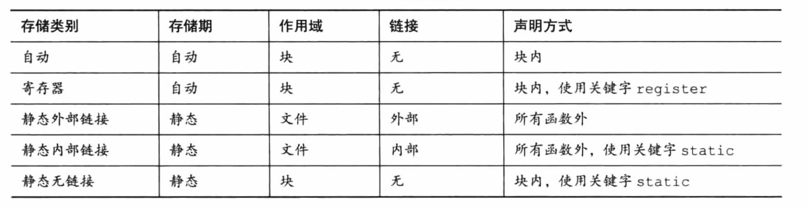

## 第十二章 存储类别、链接和内存管理
### 1. 存储类别
C语言提供多种不同的模型或者存储类别在内存中储存数据。
硬件角度
>被储存的每个值都占用一定的物理内存（这一块的内存称为对象）
>
>对象可储存一个或多个值。一个对象可能并未储存实际的值，但在储存适当的值时具有一定相应的大小。

软件角度
>需要一种方法访问对象，可通过声明变量来进行。

#### 1.1 作用域
作用域描述程序中可访问标识符区域。

**块**：一对花括号括起来的代码区域。

C变量的作用域有 `块作用域、函数作用域、函数原型作用域或文件作用域`。
>**块作用域**：声明在语句块中的变量，在语句块中可见可用。常见的块语句：`for循环、while循环、do while循环和if语句`。
>
>**函数作用域**：声明在函数体内，函数体内可用。仅用于 `goto语句` 的标签。
>
>**函数原型作用域**：形参定义到原型声明结束，仅仅在函数原型的`括号() `里面可用。
>
>**文件作用域**：变量定义在函数的外面，从定义到文件末尾可见。

#### 1.2 链接
C语言中变量有3种链接属性：***外部链接***、***内部链接*** 和 ***无链接***。
>外部链接可在多文件程序中使用，内部链接只能在当前单元使用。

无链接变量：块作用域、函数作用域、函数原型作用域

文件作用域中的变量可以是外部链接或内部链接。

存储类别说明符static 可区分外部链接和内部链接。
```cpp
int a = 6; // 外部链接
static int b = 5;// 内部链接
```

#### 1.3 存储期
作用域和链接描述了标识符的可见性。



存储期 描述了 标识符访问的对象的生存周期。

C语言中对象的4种存储期：***`静态存储期、线程存储期、自动存储期、动态分配存储期`***。
>**静态存储期**:在程序执行期间会一直存在。文件作用域变量具有静态存储期。
>
>**线程存储期**：用于并发程序设计，程序执行可分为多个线程。具有线程存储期的对象，从被声明时到线程结束一直存在。
>
>**自动存储期**：自动把变量占用的内存视为一个可重复使用的工作区或暂存区。⚠️注意点：变长数组的存储期是从声明处到块的末尾。常见的情况：局部变量


#### 1.4 自动变量
声明在块或函数头中的任何变量都属于自动存储类别（默认情况）。

可以使用 `关键字auto` 显式定义并使用自动变量。
>auto是存储类别说明符，为了考虑C/C++程序的兼容性问题，一般不建议使用。

**没有花括号的块**

>不是所有的代码块的都有花括号的，例如if和for语句。

**自动变量的初始化**

>自动变量不会初始化，除非使用显式初始化。
```cpp
int a; //仅仅分配内存空间，值未知（不一定是默认值0，可能是非常量表达式初始化自动变量）
int b = 7; //变量被初始化，分配了内存空间和初始值
```

#### 1.5 寄存器变量
变量通常是存储在计算机内存中。

目的：加快访问和处理变量的速度（加快计算速度）。

寄存器变量存储在寄存器中而非内存中，故无法获取寄存器变量的地址。


>使用存储器类别说明符register便可声明寄存器变量。
>```cpp
>void macho(register int n)
>```
>在函数头中使用 `关键字regsiter` ,便可请求形参是寄存器变量。


#### 1.6 块作用域的静态变量
静态：变量在内存中`地址固定`，不是值不动。

具有文件作用域的自动变量必须具有静态存储期。

也称为`内部静态存储类别`（函数内部，而非内部链接）。


#### 1.7 外部链接的静态变量 
外部链接的静态变量具有文件作用域、外部链接和静态存储期。也称为 `外部存储类别`。

变量称为外部变量（变量的定义性声明放在函数的外部）。

>为了说明外部变量，一般在函数中使用 `关键字 extern` 说明。
>
>如果代码文件使用的外部变量定义在另一个代码文件中，则必须使用 extern 在该文件中声明该变量。

外部变量域自动变量类似，可被显式初始化。

>区别：外部变量如果未初始化，会被自动初始化为0。

⚠️注意：外部变量只能初始化一次，且必须在定义该变量时进行。

#### 1.8 内部链接的静态变量

只能用于同一个文件中的函数。

用存储类别说明符 `static` 定义变量具有静态存储期、文件作用域和内部链接。
```cpp
static int val = 1; // 静态变量，内部链接
```

使用存储类别说明符 `extern` 在函数中重复声明任何具有文件作用域的变量。

> 该类型的声明`不会改变其链接属性`。

#### 1.10 存储类别说明符
C语言中6个存储类别说明符关键字：
- auto
>自动存储期，只能用于块作用域的变量声明中。
>
> 主要为了明确表达要使用域外部变量同名的局部变量的意图。
- register
>用于块作用域的变量。归类为寄存器。
- static
>说明符创建的对象具有静态存储期，载入程序时创建对象，当程序结束时对象消失。
- extern
- _Thread_local
- typedef

#### 1.11 存储类别和函数
函数也分为`外部函数`或`静态函数`。
>
>- `外部函数`可被其他文件的函数访问
>- `静态函数`只能用于其定义所在的文件。

一般使用 `extern关键字` 声明定义在其他文件中的函数。
>目的：表明在当前文件中使用的函数被定义在别处（该文件的外部）。
>
> 除非使用 `static关键字`，否则一般函数声明都默认为 `extern`。

#### 1.12 存储类别的选择
保护性程序设计的黄金法则：`“按需知道” 原则`。
>尽量在函数内部解决该函数的任务，只共享某些需要共享的变量。

### 2. 随机数函数和静态变量


### 3. 分配内存：`malloc()` 和 `free()` 


### 4. ANSI C类型限定符


### 👉【[复习题]()】【[练习题]()】