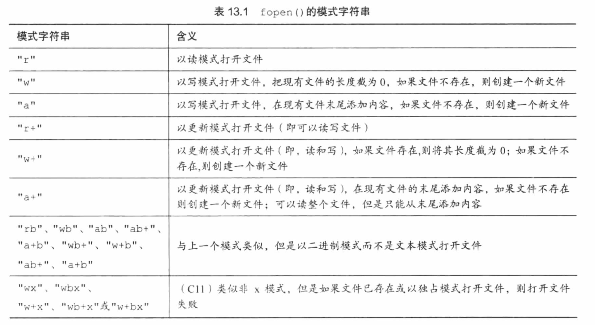

## 第十三章 文件输入/输出

### 👉【[复习题]()】【[练习题]()】
文件用于 `存储程序、文档、数据、书信、表格、照片、视频` 等。
### 1. 与文件进行通信
文件：通常是在磁盘或固态硬盘上的一段已命名的存储区。

C语言提供两种文件模式：`文本模式` 和 `二进制模式`。

**所有文件的内容都以`二进制形式（0或1）`存储**。

### 2. 标准I/O
C程序会自动打开3个文件：**`标准输入（standard input）`**、**`标准输出（standard ouput）`**、**`标准错误输出（standard error output）`**。

|标准文件|文件指针|通常使用的设备|
|:--:|:--:|:--:|
|标准输入|stdin|键盘|
|标准输出|stdout|显示器|
|标准错误|stderr|显示器|

标准I/O的好处：
- 可移植
- 有专门的函数简化了处理不同I/O的问题
- 输入和输出都是缓冲（缓冲极大提高数据传输速率）。

在打开文件时，程序一定要判断文件是否打开成功。
```cpp
if(fopen==NULL){ 
    ...
    exit(EXIT_FAILURE);
}
```
> 一旦打开失败，直接会终止后续操作。

`exit() 函数` 关闭所有打开的文件并结束程序。

在stdlib.h头文件中：
>标准要求 `0 `或 宏 `EXIT_SUCCESS`：表明成功结束程序。
>
>宏 `EXIT_FAILURE`：表明结束程序失败。

#### 2.1 `fopen()` 和 `fclose()` 函数
都声明在 `stdlib.h` 头文件中。

|函数|函数原型|语法格式|功能|备注|
|:--:|:--|:--|:--|:--|
|`fopen()`|`FILE *fopen(const char *filename,const char * mode);`|`FILE *fp = fopen("filename",mode)`|打开文件|返回一个文件指针：FILE *fp 指向一个记录文件信息的数据结构<br>例：`fp = fopen("hello_c.txt","r");`|
|`fclose()`|`int fclose(FILE * stream);`|`fclose(fp)`|关闭文件|关闭成功返回0，失败返回EOF(-1)，存储空间不足或者被移除都会出现I/O错误，都会导致失败。|
>文件指针的类型是指向FILE的指针，FILE是一个定义在 `stdlib.h` 中的`派生类型`。

mode的内容参考：



#### 2.2 `getc()` 和 `putc()` 函数
与 `getchar()` 和 `putchar()` 函数类似。

区别：
>需要告知 `getc()` 和 `putc()` 函数 使用哪一个文件。

|函数|函数原型|语法格式|功能|备注|
|:--:|:--|:--|:--|:--|
|`gets()`|`int getc(FILE *stream)`|`ch = getc(fp)`|从fp指定文件中获取一个字符，读到文件结尾返回EOF|`getc(stdin) == getchar(ch);`|
|`putc()`|`int putc(int char,FILE *stream)`|`putc(ch,fp)`|把ch放入fp指向文件|`puts(ch,stdout) == putchar(ch);`|

#### 2.3 一个简单的文件压缩程序
例子：把一个文件中选定的数据拷贝到另一个文件中。
```cpp
//reducto.c 把文件压缩成原来的1/3
#define _CRT_SECURE_NO_WARNINGS
#include<stdio.h>
#include<stdlib.h> //提供exi()原型
#include<string.h> //提供strcpy()、strcat()原型
#define LEN 40
int main(int argc, char * argv[])
{
	FILE * in, *out; //声明两个指向FILE的指针
	int ch; 
	char name[LEN]; //存储输出文件名
	int count = 0;
 
	if (argc < 2)//检查命令行参数
	{
		fprintf(stderr, "Usage: %s filename\n", argv[0]);
		exit(EXIT_FAILURE); //表明程序失败退出
	}
	//设置输入，设置mode为可读
	if ((in = fopen(argv[1], "r")) == NULL)
	{
		fprintf(stderr, "I couldn't open the file \"%s\"\n ", argv[1]);
		exit(EXIT_FAILURE);
	}
	//设置输出
	strncpy(name, argv[1], LEN - 5); // 拷贝文件名
	name[LEN - 5] = '\0';
	strcat(name, ".red");
	if ((out = fopen(name, "w")) == NULL) //设置可写方式打开file
	{
		fprintf(stderr, "Can't create output file.\n");
		exit(3);
	}
	//拷贝数据
	while ( (ch=getc(in))!=EOF) //通过使用EOF来告知程序已经读取到文件结尾，从而结束程序。
	{
		if (count++ % 3 == 0)
			putc(ch, out);
	}
	if (fclose(in) != 0 || fclose(out) != 0)
		fprintf(stderr, "Error in closing files.\n");
 
	return 0;
}
```
>`fprintf()`和 `printf()` 类似，⚠️注意点：`fptrintf()` 第一个参数必须是一个`文件指针`。


### 3. 文件I/O：fprintf()、fscanf()、fgets()、fputs()

#### 3.1 `fprintf()` 和 `fscanf()` 函数
`fprintf()` 和 `fscanf()`函数的工作方式与 `printf()` 和 `fscanf()`函数的类似。

👉小区别：
>`fprintf()` 和 `fscanf()` 函数的第一个参数`必须指定待处理的文件`。

例子：
```cpp
/*addaword.c --fprintf() fscanf() rewind()*/
#define _CRT_SECURE_NO_WARNINGS
#include<stdio.h>
#include<stdlib.h>
#include<string.h>
#define MAX 41
 
int main(void)
{
	FILE *fp;
	char words[MAX];
	if ((fp = fopen("wordy", "a+")) == NULL) //更新（读写）模式打开文件，只允许在文件末尾添加内容
	{
		fprintf(stdout, "Can't open \"wordy\" file.\n");
		exit(EXIT_FAILURE);
	}
	puts("Enter words to add to the file; press the #");
	puts("key at the beginning of a line to terminate.");
	while ((fscanf(stdin, "%40s", words) == 1) && (words[0] != '#'))
		fprintf(fp, "%s\n", words);
	puts("File contents:");
    /** 关于 rewind() 函数的介绍说明
     *
     * rewind()函数 在头文件 stdio.h 中
     * 用于将文件指针重新指向文件的开头，同时清除和文件流相关的错误和EOF标记。
     * 相当于调用 fseek()函数
     * 函数原型：void rewind(FILE *stream);
     * 
     */
	rewind(fp);//回到文件开始处。
	while (fscanf(fp, "%s", words) == 1)
		puts(words);
	puts("Done!");
	if (fclose(fp) != 0)
		fprintf(stderr, "Error closing file\n");
 
	return 0;
}
```

#### 3.2 `fgets()` 和 `fputs()`函数
移步 👉 【[第11章]()】


### 4. 随机访问

#### 4.1 `fseek()` 和 `ftell()` 函数

|函数名|函数原型|功能|参数|返回值|
|:--|:--|:--|:--|:--|
|`fseek()`|`int fseek(FILE *stream, long int offset, int whence);`|重定位流上的文件指针|第一个参数stream为`文件指针`<br>第二个参数offset为`偏移量`，正数表示正向偏移，负数表示负向偏移<br>第三个参数是`模式`，确定文件起始点,几种明示常量为：`SEEK_SET（文件开头）、 SEEK_CUR（当前位置） 或 SEEK_END（文件末尾）`|如果成功，则该函数返回零，否则返回非零值。|
|`ftell`|`long ftell(FILE *stream);`|得到文件位置指针当前位置相对于文件首的偏移字节数。|`FILE *stream`返回指针的文件流|成功----返回当前文件指针的位置<br>出错----返回-1L，是长整数的-1值。|

`fseek`例子：
```cpp
fseek(fp,0L,SEEK_SET); //定位至文件开始处
fseek(fp,10L,SEEK_SET); //定位至文件中的第10个字节
fseek(fp,2L,SEEK_CUR); //从文件当前位置前移2个字节
fseek(fp,0L,SEEK_END); // 定位至文件结尾
fseek(fp,-10L,SEEK_END); // 从文件结尾处回退10个
```

`ftell`例子：
```cpp
#include<stdio.h>

int main()
{
	FILE *stream;
	int len;

	stream = fopen("file.txt","r"); // 只读方式打开
	if(stream == NULL)
	{
		perror("打开文件错误");
		return(-1);
	}
	fseek(stream,0,SEEK_END);
	len = ftell(stream); //返回类型为long，把file.txt文件开始处到文件结尾的字节数赋给len
	fclose(stream);

	printf("file.txt的总大小为 = %d 字节\n",len);

	return(0);
}
```
假设文件file.txt中的内容为
```txt
www.github.com/solerho
```
使用gcc运行程序后结果如下：
```shell
[root@centos8 examples]# gcc ftell.c 
[root@centos8 examples]# ls
a.out  file.txt  ftell.c
[root@centos8 examples]# ./a.out 
file.txt的总大小为 = 23 字节
```

#### 4.2 二进制模式和文本模式
不同之处：
- UNIX
	- UNIX只有一种文件格式，所以不需要进行特殊的转换。
	- UNIX使用 `\n` 表示换行符。
	>以`文本模式`打开时，C能识别`Ctrl-Z`作为`文件结尾标记的字符`。
	>
	>以`二进制模式`打开相同的文件时，`Ctrl-Z` 字符被看作是`文件中的一个字符`，而实际的文件结尾符在该字符后面。
- MS-DOS
	- MS-DOS编译器都用 `Ctrl + Z` 标记文件。
	- MS-DOS用 `\r\n` 组合表示文件换行符。
	>以`文本模式`打开相同的文件，C程序把`\r\n`看成`\n`，但是，以二进制模式打开该文件时，程序能看见这两个字符。
#### 4.3 可移植性


### 5. 其他I/O函数


