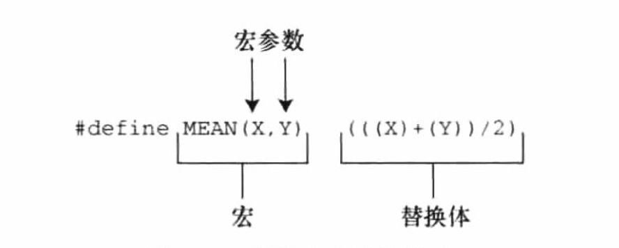

## 第十六章 C预处理器和C库

### 👉【[复习题](./复习题.md)】【[编程练习题](./编程题.md)】

### 1. 翻译程序工具 ----> 编译器
在预处理之前，编译器会做一些翻译处理工作。

- 把源代码中出现的`字符`映射到`源字符集`。
- 定位每个`反斜杠`后面跟着`换行符的实例`，并直接删除。
>将物理行转换成逻辑行。
```cpp
printf(“That's wond\
        erful!\n")； 
```
转成
```cpp
printf(“That's wonderful!\n");
```

- 编译器把`文本`划分成`预处理记号序列`、`空白序列` 和 `注释序列`（记号是由空格、制表符或换行符分隔的项）。

⚠️注意：编译器会用一个`空格字符`替换`每一条注释`。
```cpp
int /*这看起来不像是一个空格*/ fox;
```
将变成
```cpp
int fox;
```

### 2. 明示常量：`#define`
`#define预处理器` 指令 和 `其他预处理器`指令一样，以 `# `作为一行的开始。
>ANSI 和后来标准都允许 `#` 前面有`空格`或 `制表符`，也允许在 `#` 和指令的其余部分之间有空格。

⚠️注意：指令长度仅限于一行（从#开始运行，到后面的第一个换行符为止）。

#### 2.1 每行 `#define（逻辑行）`的3部分
- `#define`指令本身
- 选定的缩写，也称为`宏`。
    > 宏代表值称为`类对象宏`。
    >
    > 宏的名称中不允许有空格。遵循C变量的命名规则。
- 替换列表或替换体。
    > 从宏替换文本的过程称为`宏展开`。

⚠️注意：可在`#define`行使用标准C注释。

宏可以表示任何字符串，也可表示整个C表达式。

~~预处理器不做计算，不对表达式求值~~ ，只替换字符序列。

### 3. 在`#define`中使用参数

用#define创建类似函数的类函数宏,~~~不是函数~~。

类函数宏定义的圆括号可以有一个或多个参数，随后参数出现在替换体中。

> MEAN 是宏标识符

**函数调用和宏调用的区别**
- 函数调用：在`程序运行时`把参数的值传递给函数。
- 宏调用`在编译之前`把参数记号传递给程序。

⚠️注意：必要时使用足够多的圆括号来确保运算结合的正确顺序。

~~不要在宏中使用递增或递减运算。~~

#### 3.1 用宏参数创建字符串：`#运算符`
例：
```c
#define PSQR(X) printf("The square of X id %d .\n",((X)*(X)));
```
> 双引号字符串中的X视为普通文本，而不是可被替换的记号。

C允许在字符串中包含宏参数。在类宏函数的替换体中，`#号`作为一个`预处理运算符`，可以把记号转化为`字符串`，这样的过程叫作`字符串化（stringizing）`。例如，双引号中想表示宏形参，则使用 `#X` 即可。

#### 3.2 预处理器粘合剂：`##运算符`
可用于`类函数宏`和`对象宏`的替换部分。把两个记号组合成一个新的标识符。

#### 3.3 变参宏：`...` 和 `__VA_ARGS__`
通过把`宏参数列表`中最后的参数写成`省略号（即3个点...）`来实现这一功能。`预定义宏__VA_ARGS__`可用于替换部分中，表明省略号代表什么。

格式：
```c
#define PR(...) printf(__VA_ARGS__)
```
C99/C11对宏提供让用户自定义带可变参数的函数。由 `stdvar.h 头文件`提供。

⚠️记住：省略号只能代替最后的宏参数。

### 4. 宏和函数的选择
#### 4.1 如何选择？
- 使用宏比普通函数更复杂一些，稍有不慎会有副作用。（一些编译器规定宏只能定义成一行）
- 需要注意时间和空间的制衡。
    - 宏生成内联代码，在程序中生成语句。函数调用无论多少次，程序中只有一份函数语句的副本，节省了空间。
    - 程序的控制必须跳转到函数内，随后再返回主调函数，这比内联代码花费更多时间。
- 对于简单的函数，程序员通常使用宏

#### 4.2 宏的注意点
- 宏名不允许有空格，但替换字符中可以有空格。
- 圆括号把宏的参数和整个替换体括起来，能确保被括起来的部分在表达式正确展开。
- `大写字母表示宏函数的名称`（大写字母可以提醒程序员可能产生副作用）。例如：`MAX(X,Y)`
- 如果打算使用宏加快程序运行速度，首先要确定使用宏和使用参数是否会导致较大的差异。
> 在程序中使用一次的宏无法明显减少程序的运行时间，在嵌套循环中使用宏更有助于提高效率。

### 5. 文件包含：`#include`
预处理器在发现 `#include指令`时，会查看后面的文件名并把文件内容包含到当前文件中（替换`源文件`中的`#include指令`），相当于被包含文件的全部内容输入到源文件#include指令所在的位置。
```cpp
#include<stdio.h>     // 尖括号是标准系统文件中
#include "mystuff.h"  // 双引号是自定义的头文件（一般是优先查找当前工作目录）
```
ANSI C不为文件提供统一的目录模型，不同计算机所用的系统不同。

C语言习惯用 `.h` 后缀表示头文件，一般是包含需要放在程序顶部的信息。
> 头文件经常包含一些预处理器指令。

`#define指令、结构声明、typedef和函数原型` 是编译器在创建`可执行代码`时所需的信息，而~~不是可执行代码~~。

用 `#ifndef` 和 `#define` 防止多重包含头文件。`可执行代码`通常是`源代码文件`中，而不是`头文件`中。

#### 5.1 使用头文件
- 明示常量：`stdio.h` 中定义的`EOF、NULL和BUFSIZE`（标准I/O缓冲区大小）
- 宏函数：`getc(stdin)`通常用`getchar()`定义，而`getc()`经常用于定义较复杂的宏，`头文件 ctype.h` 通常包含 `ctype`系列函数的宏定义。
- 函数声明：`string.h 头文件`包含字符串函数系列的`函数声明`（函数声明都是函数原型形式）。
- 结构模版定义：标准I/O函数使用`FILE结构`（结构包含了文件和与文件缓冲区相关的信息）。`FILE结构`在`头文件stdio.h`中
- 类型定义：标准I/O函数使用`指向FILE的指针`作为参数。
> stdio.h 用 `#define` 或 `typedef` 把`FILE`定义为`指向结构的指针`。

`#include` 和 `#define 指令` 是最常用的两个C预处理器特性。

### 6. 其他指令
修改`#define`的值即可 *生成* 可移植性的代码。

`#undef指令` *取消* 之前的`#define`定义。

`#if、#ifdef、ifndef、#else、#elif 和 endif 指令` 用于指定什么情况下编写哪些代码。

`#line` 指令用于重置行和文件信息。

`#error` 指令用于给出错误信息。

`#pragma` 指令用于向编译器发出指令。

#### 6.1 `#undef`指令
`#undef`指令用于 “取消” 已定义的 `#define` 指令。

处理器在识别标识符时，遵循与C相同的规则：标识符可以由 `大写字母、小写字母、数字 和 下划线字符`组成，且~~首字符不能是数字~~。

`#define宏`的作用域从它的文件中的`声明处开始`，直到用 `#undef 指令取消宏`为止，延伸至文件尾（以二者中先满足的条件作为宏作用域的结束）。

⚠️注意：如果宏通过`头文件`引入，则`#define`在文件中的位置取决于`#include指令的位置`。

#### 6.2 条件编译
使用指令告诉编译器根据编译时的条件执行或忽略信息（或代码）块。

- `#ifdef、#else 和 #endif指令`
    - ifdef 指令：预处理器已定义后面的标识符，则执行`#else` 或`endif指令`之前的所有指令并编译所有C代码。
    - 如果未定义标识符，且有`#else指令`，则执行`#else` 和 `#endif指令`直接的所有代码。

`ifdef、#else` 与C的`if else`的区别：
> 预处理器不识别用于标记块的花括号（`{}`）,因此使用 `#else（如果需要）` 和 `#endif（必须存在）` 来标记指令块。且这些指令结构可以`嵌套`或`标记C语句块`。

- `ifndef`指令
与ifdef类似。只是逻辑相反。

`#ifndef指令`判断后面的标识符`是否是未定义`的，常用于`定义之前未定义`的常量。


- `#if` 和 `elif`指令


#### 6.3 
